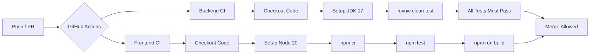

# VeloDrive — Car Dealership Inventory System

[](https://github.com/Smt31/incubyte-TDD-Kata/actions/workflows/ci.yml)

VeloDrive is a modern, full-stack **Car Dealership Inventory Management System** built with **Spring Boot 3** and **React 18**. It features secure **JWT authentication**, granular **Role-Based Access Control (RBAC)**, and a beautifully crafted, responsive dark-mode UI.

The entire project was developed following a strict **Test-Driven Development (TDD)** methodology — tests were written *before* the implementation code, ensuring a reliable, regression-proof, and maintainable codebase from the ground up.

---

## Live Demo

## 🌐 Live Demo

**Application:**  
https://incubyte-kata-sarthak.vercel.app

### Demo Credentials

| Role | Email | Password |
|------|-------|----------|
| User | `user@demo.com` | `User@123` |
| Admin | `admin@demo.com` | `Admin@123` |

---

## Key Features

- **Authentication & Security** — JWT-based user registration and login with protected API endpoints.
- **Role-Based Access Control (RBAC)** — `USER` can browse, search, and purchase vehicles, while `ADMIN` can add, update, delete, and restock vehicles.
- **Vehicle Management** — Complete CRUD operations with validation and role-based authorization.
- **Vehicle Search & Filtering** — Search vehicles by make, model, category, and price range.
- **Inventory Management** — Purchase decreases stock, restock increases stock, and out-of-stock vehicles cannot be purchased.
- **Responsive User Interface** — Modern React-based interface for authentication and inventory management.
- **Test-Driven Development (TDD)** — Developed following the Red → Green → Refactor workflow with backend and frontend tests.
- **Dockerized Application** — Backend and frontend containerized using Docker and Docker Compose.
- **Continuous Integration** — GitHub Actions automatically builds and tests the application on every push and pull request.

---

## Technology Stack

| Layer | Technologies |
| :--- | :--- |
| **Backend** | Java 17, Spring Boot 3, Spring Security, JWT, Spring Data JPA (Hibernate), PostgreSQL (Neon) |
| **Frontend** | React 18, Vite, React Router, Axios, CSS |
| **Testing** | JUnit 5, Mockito, MockMvc, Vitest, React Testing Library |
| **DevOps** | Docker, Docker Compose, GitHub Actions, Render, Vercel |

---

## Application Screenshots

### Login Page


### Admin Dashboard — Vehicle Catalog & Inventory Management


---

## Test Report (TDD)

This project was built using the **Red → Green → Refactor** TDD cycle. Every feature started with a failing test, was made to pass with minimal code, and then refactored for quality.

*   **Backend Testing** — Multi-layered coverage using JUnit 5, Mockito, and MockMvc:
    *   *Unit Tests* — Verifies business rules, input validations, and service-level constraints.
    *   *Integration Tests* — Ensures correct interaction with the database repository layer.
    *   *Controller Tests* — Validates HTTP response codes, JSON payloads, and Spring Security rules.
*   **Frontend Testing** — Component-level verification using Vitest and React Testing Library:
    *   *State & Rendering* — Validates component rendering and state transitions (e.g. login form, vehicle catalog).
    *   *User Interactions* — Tests form submissions, search query filtering, and event triggers.
    *   *API Mocking* Mocks Axios requests to isolate front-end components from the backend API.
*   **Continuous Integration** — Automatic testing triggers on push and pull requests:
    *   Assures the main branch remains green by blocking pull requests with failing tests.

### TDD Proof — Red → Green → Refactor Cycle

The following screenshots were captured during actual development and demonstrate the Test-Driven Development workflow used throughout the project.

**Red Phase** — Tests written first, all failing before implementation:


**Green Phase** — Implementation written to make all tests pass:


**Refactor Phase** — Code cleaned and restructured while ensuring all tests continued to pass. This phase focused on improving readability, extracting reusable methods, and following SOLID principles — without changing any external behavior.

### Backend Code Coverage (JaCoCo)

The backend test suite was executed using JaCoCo to measure code coverage after running all JUnit tests.

*   **Instruction Coverage:** 92%
*   **Line Coverage:** 95%
*   **Method Coverage:** 89%
*   **Class Coverage:** 100%

#### JaCoCo Coverage Summary


---

## Dockerization

The entire application is containerized for consistent, reproducible deployments across any environment.

### Architecture

```
┌─────────────────────────────────────────────┐
│              docker-compose.yml             │
├─────────────────┬───────────────────────────┤
│    Frontend     │         Backend           │
│  (Node Alpine)  │  (Temurin JDK 17 Alpine)  │
│    Port: 80     │       Port: 8080          │
│                 │                           │
│  npm run build  │   Multi-stage build:      │
│  npm run preview│   1. Maven → compile      │
│                 │   2. JRE → run JAR        │
└────────┬────────┴──────────┬────────────────┘
         │                   │
         └───────┬───────────┘
                 │
         ┌───────▼───────┐
         │   NeonDB      │
         │  (PostgreSQL)  │
         │   Serverless   │
         └───────────────┘
```

*   **Backend Containerization**
    *   Uses a **multi-stage Docker build** to compile the Spring Boot JAR with Maven.
    *   Runs the final application in a lightweight `eclipse-temurin:17-jre-alpine` image to optimize image footprint (~150MB).
*   **Frontend Containerization**
    *   Builds the React production bundle using Vite.
    *   Serves the static assets efficiently via `vite preview`.
*   **Docker Compose Orchestration**
    *   Links backend and frontend services under a shared local network.
    *   Injects required environment variables from the `.env` file dynamically.
    *   Enforces service dependency ordering, ensuring the frontend only starts after the backend API is healthy.

### Quick Start with Docker

```bash
git clone https://github.com/Smt31/incubyte-TDD-Kata.git
cd incubyte-TDD-Kata
# Create your .env file (see below)
docker compose up -d --build
```

---

## CI/CD Pipeline

The project uses **GitHub Actions** for continuous integration and continuous deployment. The pipeline is triggered on every `push` and `pull_request` to the `main`/`master` branch.

### Pipeline Architecture



**Key details:**
*   **Verification Gates**
    *   **Backend CI** — Pulls JDK 17 (Temurin), configures Maven caching, and runs all unit/integration tests (`./mvnw clean test`).
    *   **Frontend CI** — Sets up Node.js 20, enables npm caching, installs packages (`npm ci`), runs the test suite (`npm test`), and builds the project.
*   **Security & Deployment**
    *   **Branch Protection Rules** — Restricts direct merges to `main`; requires all CI pipelines to pass before code integration.
    *   **Automated Continuous Deployment** — Vercel auto-deploys frontend commits, and Render initiates backend container updates upon merge.

---

## Local Setup & Installation

### Prerequisites

- **Java 17+** (for backend)
- **Node.js 20+** & **npm** (for frontend)
- **Docker & Docker Compose** (optional, for containerized setup)

### Option 1: Run with Docker Compose

Starts the complete application (frontend + backend) with a single command using a production-like environment.

1.  **Clone the repository:**
    ```bash
    git clone https://github.com/Smt31/incubyte-TDD-Kata.git
    cd incubyte-TDD-Kata
    ```

2.  **Create a `.env` file** in the root directory:
    ```env
    DATABASE_URL=jdbc:postgresql://<your-db-host>:5432/<your-db-name>?sslmode=require
    DATABASE_USERNAME=<your-db-username>
    DATABASE_PASSWORD=<your-db-password>
    JWT_SECRET=<your-very-long-jwt-secret-key-at-least-32-characters>
    ```

3.  **Start the containers:**
    ```bash
    docker compose up -d --build
    ```

4.  **Access the application:**
    | Service | URL |
    | :--- | :--- |
    | Frontend | `http://localhost:80` |
    | Backend API | `http://localhost:8080` |

### Option 2: Run Manually (Without Docker)

**Backend:**
```bash
cd backend

# Configure environment variables (PowerShell):
$env:DATABASE_URL="jdbc:postgresql://<host>:5432/<db>?sslmode=require"
$env:DATABASE_USERNAME="<username>"
$env:DATABASE_PASSWORD="<password>"
$env:JWT_SECRET="<your-secret>"

# Run the server:
./mvnw spring-boot:run
# Backend starts at http://localhost:8080
```

**Frontend:**
```bash
cd frontend
npm install
npm run dev
# Frontend starts at http://localhost:5173
```

> **Note:** When running manually, the Vite dev server proxies `/api` requests to `http://localhost:8080` automatically — no extra configuration needed.

### Running Tests

**Backend tests:**
```bash
cd backend
./mvnw clean test
```
*   **Test Coverage** — Once the tests complete, the local coverage report is generated at `backend/target/site/jacoco/index.html`.


**Frontend tests:**
```bash
cd frontend
npm test
```

---

## Project Structure

```
incubyte-TDD-Kata/
├── .github/workflows/
│   └── ci.yml                  # GitHub Actions CI/CD pipeline
├── backend/
│   ├── src/main/java/com/cardealership/
│   │   ├── config/             # Security & JWT configuration
│   │   ├── controller/         # REST API endpoints
│   │   ├── model/              # JPA entities (User, Vehicle)
│   │   ├── repository/         # Spring Data JPA repositories
│   │   └── service/            # Business logic layer
│   ├── src/test/               # JUnit 5 + Mockito test suites
│   ├── Dockerfile              # Multi-stage backend container
│   └── pom.xml                 # Maven dependencies
├── frontend/
│   ├── src/
│   │   ├── components/         # Reusable React components
│   │   ├── context/            # Auth context provider
│   │   ├── pages/              # Login, Register, Dashboard
│   │   ├── services/           # Axios API client
│   │   └── test/               # Vitest + RTL test suites
│   ├── Dockerfile              # Frontend container
│   └── package.json            # npm dependencies
├── docker-compose.yml          # Multi-container orchestration
├── .env                        # Environment variables (not committed)
└── README.md                   # You are here!
```
---

## REST API Endpoints

### Authentication

| Method | Endpoint | Description | Access |
| :---: | :--- | :--- | :---: |
| `POST` | `/api/auth/register` | Register a new user | Public |
| `POST` | `/api/auth/login` | Authenticate user and return JWT | Public |

### Vehicle Management

| Method | Endpoint | Description | Access |
| :---: | :--- | :--- | :---: |
| `GET` | `/api/vehicles` | Retrieve all available vehicles | Authenticated |
| `GET` | `/api/vehicles/search` | Search vehicles by make, model, category, or price range | Authenticated |
| `POST` | `/api/vehicles` | Add a new vehicle | Admin |
| `PUT` | `/api/vehicles/{id}` | Update vehicle details | Admin |
| `DELETE` | `/api/vehicles/{id}` | Delete a vehicle | Admin |

### Inventory Management

| Method | Endpoint | Description | Access |
| :---: | :--- | :--- | :---: |
| `POST` | `/api/vehicles/{id}/purchase` | Purchase a vehicle and decrease stock quantity | Authenticated |
| `POST` | `/api/vehicles/{id}/restock` | Restock a vehicle and increase stock quantity | Admin |

### System

| Method | Endpoint | Description | Access |
| :---: | :--- | :--- | :---: |
| `GET` | `/api/health` | Health check endpoint for uptime monitoring | Public |

---

## My AI Usage

In alignment with modern development practices, I leveraged AI tools as a pair-programming partner throughout this project.

### Tools Used

| Tool | How I Used It |
| :--- | :--- |
| **Antigravity (Gemini & Claude)** | Primary AI pair-programmer inside my IDE for scaffolding, debugging, refactoring, code reviews, and TDD assistance. |
| **ChatGPT** | Used for debugging deployment issues, explaining Spring Security/JWT concepts, refining commit messages, improving documentation, and validating architectural decisions. |
| **Stitch AI** | Generated an initial UI concept, which I used as visual inspiration for designing the frontend. |

### How I Used AI

*   **Scaffolding & Boilerplate**
    *   Utilized Antigravity to generate boilerplate structures for repetitive components such as DTOs, repository interfaces, and controller skeletons.
    *   Manually integrated, annotated, and extended the generated files to include validation, business logic, and custom error handling.
*   **Test-Driven Development (TDD)**
    *   Leveraged AI to construct standard testing setups, including Mockito structures, MockMvc controller configurations, and basic test skeletons.
    *   Designed, implemented, and executed all specific test assertions, edge cases, and business logic validations manually to drive the Green and Refactor phases.
*   **UI Design & Styling**
    *   Used Stitch AI to generate initial design references for the overall layout and color scheme.
    *   Used Antigravity to translate visual requirements into a responsive Vanilla CSS design system.
    *   Refined elements including mobile viewport breakpoints, flex/grid alignments, transitions, and hover effects manually.
*   **Security & Backend Operations**
    *   Brainstormed stateless JWT authentication architecture, CORS policies, and Spring Security filter chains.
    *   Independently verified, tested, and customized every configuration block before integrating it to guarantee security standard compliance.

### Reflection

I treated AI as a pair-programming assistant rather than an autonomous code generator. It accelerated development and learning, but the final design decisions, implementation details, testing strategy, and debugging remained my responsibility.

